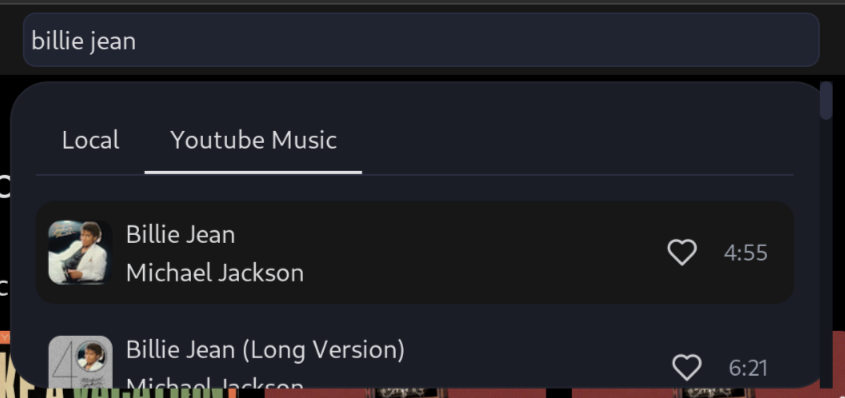

# Project Encore

**Experimental YouTube Music plugin for [Cleftly](https://github.com/wxllow/cleftly)**



## Build

```bash
bun run build
```

## Install

Encore can be installed after building by importing the `dist/encore.js` module into Cleftly on the plugins tab.

## Credits

- [ytmusic-api](https://github.com/zS1L3NT/ts-npm-ytmusic-api)
